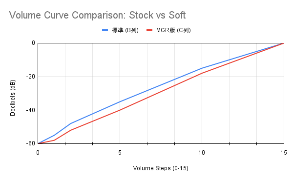

# Soft Volume Curve for Nothing(2a)

## What is this mod?
ベッドに入ってからの動画視聴、音楽を聴くとき少しうるさくありませんか？このモジュールを入れると、程良く音量の調整ができます。

## What is this mod?
このモジュールは、「15段階という枠組みは変えず、1段あたりの音量変化（曲線）を再設計する」というアプローチで、深夜でも使える繊細な音量微調整を実現しました。
This mod re-designs the volume curve for each step while maintaining the standard 15-step hardware limit. It enables delicate volume adjustments perfect for quiet environments or nighttime use.

## How does it work?
`audio_policy_volumes.xml` をシステムレベルで上書きし、OSが音量を計算する際の「カーブ（減衰率）」を書き換えます。
By overriding the `audio_policy_volumes.xml` at the system level, it modifies the "attenuation curve" used by the OS to calculate output levels.

- **Soft Start**: 音量1の立ち上がりを標準より深く（静かに）設定。
  Sets the first volume step to be much quieter than the default for a softer start.
- **Delicate Steps**: 序盤（音量1〜7付近）の上がり幅を極限までなだらかにし、微調整を可能に。
  Minimizes volume increments in the lower range (steps 1–7) to allow for fine-tuned control.
- **Safety First**: ステップ数自体を変更しないため、Nothing Phone (2a) で発生しがちな「特定の段階で音が消える」トラブルを完全に回避します。
  By not changing the total number of steps, it completely avoids the common "no sound at higher steps" bug on Nothing Phone (2a).

## Requirements
+ Magisk 20.0+
+ Nothing Phone (2a) or Nothing OS devices

## How to Install
1. GitHubの **Releases** から最新の `zip` ファイルをダウンロードします。
2. Magiskアプリを開き、「モジュール」タブを選択します。
3. 「ストレージからインストール」をタップし、ダウンロードした `zip` ファイルを選択します。
4. インストール後、デバイスを再起動してください。

## Credits
- Created by **MGR-dev**

## Disclaimer
- Use this module at your own risk. I am not responsible for any damage to your device.
- 導入は自己責任で行ってください。このモジュールによって生じたいかなる損害についても責任を負いません。
